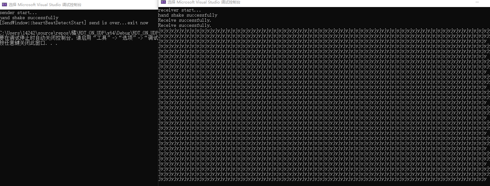
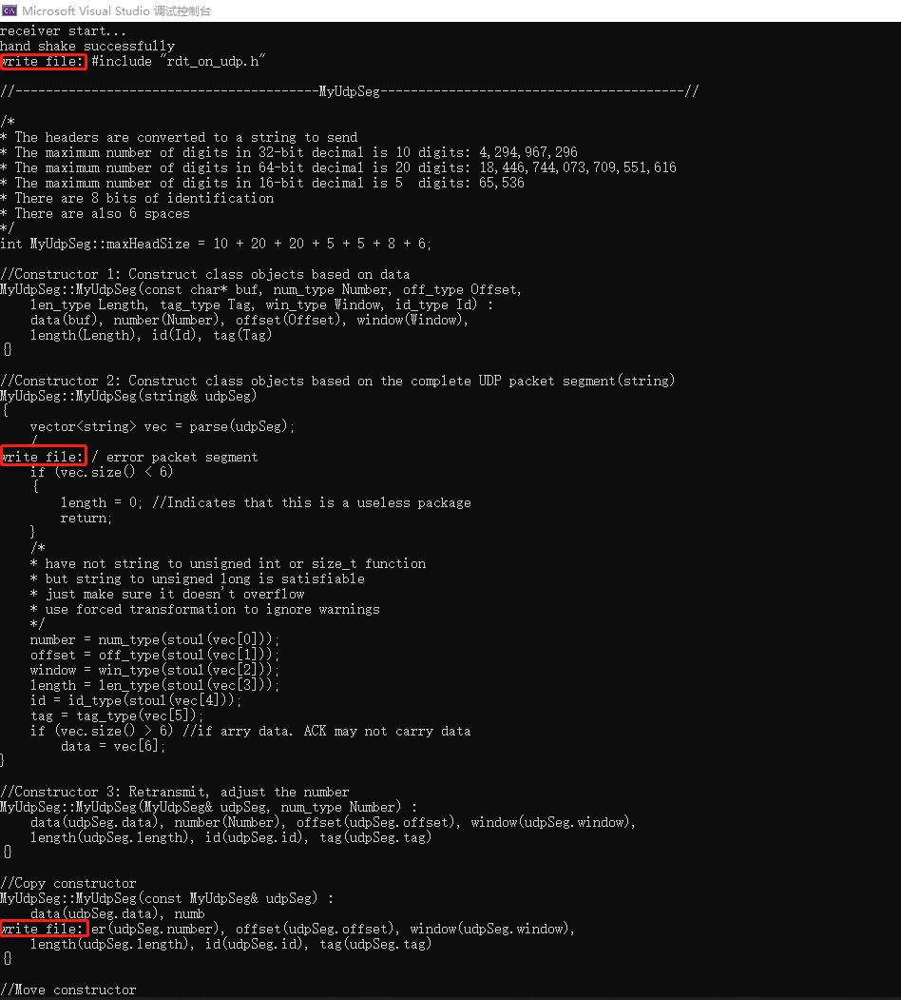
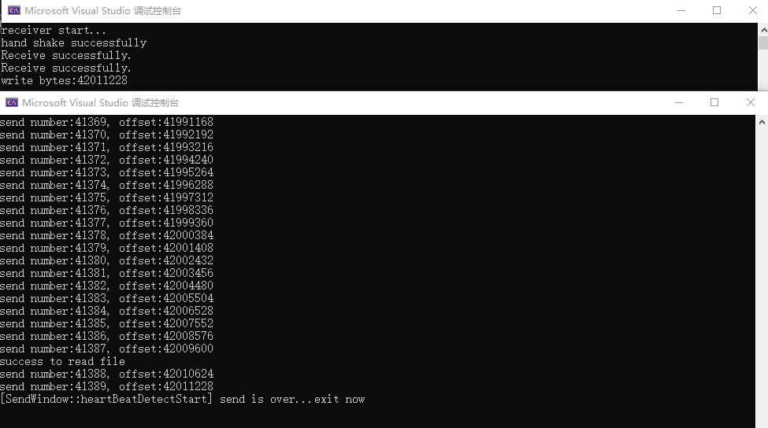
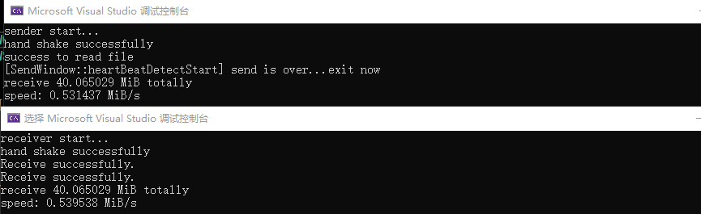
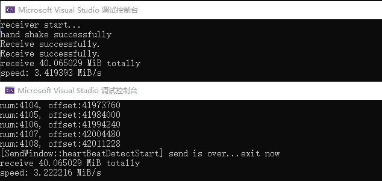

# Test

进行三类测试，测试代码可以在code文件夹中找到。

因为是事情比较多是抽时间做的，分了好几次做完，如果代码有任何问题和任何bug，可以在GitHub上issue，也欢迎联系邮箱`chen_jy@sjtu.edu.cn`。

-----

* 本机内：
  * 本机简单收发
  * 本机文件收发
* 同内网主机：
  * 简单收发
  * 文件收发
* 不同内网主机（基于udp打洞实现的内网穿透）
  * 简单收发
  * 文件收发

> 注：在本机测试和同内网主机测试中遇到了bug，当时采用了简单的办法（降速）去解决但治标不治本，具体的解决方法在problem solution章节
>
> 解决完该问题后速度有显著的提高。

# 本机测试

## 简单收发

### 测试代码

```c++
//sender_1.cpp

#include "rdt_on_udp.h"

void initSocket()
{
    WORD sockVersion = MAKEWORD(2, 2);
    WSADATA wsaData;

    if (WSAStartup(sockVersion, &wsaData) != 0)
    {
        std::cerr << "WSAStartup() error!" << std::endl;
        exit(1);
    }
}
int main()
{
    initSocket();
	Sender sender("127.0.0.1", 10001);
	sender.start();
    string data;
    for (int i = 0; i < 10; i++)
    {
        for (int j = 0; j < 200; j++)
            data += "jy";
        data += "\n";
    }
        
	sender.send(data.c_str(), data.size());
    WSACleanup();
	return 0;
}
```

```c++
//receiver_1.cpp

#include "rdt_on_udp.h"

//user need to init WSA and close
void initSocket()
{
    WORD sockVersion = MAKEWORD(2, 2);
    WSADATA wsaData;

    if (WSAStartup(sockVersion, &wsaData) != 0)
    {
        std::cerr << "WSAStartup() error!" << std::endl;
        exit(1);
    }
}
int main()
{
    initSocket();
	Receiver receiver(10001);
	receiver.start();
	string data = receiver.recv();
    printf("%s\n", data.c_str());
    WSACleanup();
	return 0;
}
```

### 测试结果



## 文件收发

### 测试代码

这个不好获得测试结果，首先传一个小文件并让接收方把它在控制台打印出来，这里传一个txt文件，内容就是`rdt_on_udp.cpp`，大小位39KB。

```c++
//sender_2.cpp

#include "rdt_on_udp.h"

void initSocket()
{
    WORD sockVersion = MAKEWORD(2, 2);
    WSADATA wsaData;

    if (WSAStartup(sockVersion, &wsaData) != 0)
    {
        std::cerr << "WSAStartup() error!" << std::endl;
        exit(1);
    }
}
int main()
{
    initSocket();
	Sender sender("test.txt" ,"127.0.0.1", 10001);
	sender.start();
        
	sender.sendFile();
    WSACleanup();
	return 0;
}
```

```c++
//receiver_2.cpp

#include "rdt_on_udp.h"

//user need to init WSA and close
void initSocket()
{
    WORD sockVersion = MAKEWORD(2, 2);
    WSADATA wsaData;

    if (WSAStartup(sockVersion, &wsaData) != 0)
    {
        std::cerr << "WSAStartup() error!" << std::endl;
        exit(1);
    }
}
int main()
{
    initSocket();
    Receiver receiver(10001, "test.txt");
	receiver.start();
	receiver.recvFile();
    WSACleanup();
	return 0;
}
```

### 测试结果

打印信息正确且写入文件成功



### 进一步测试

现在测试传一个pdf，这能帮助看数据是否有错误。这里传一个40MB大小的图形学GAMES101的笔记。

经过测试，收发成功且可以正常打开pdf。



### some problem

> 注：已经解决，不是下面说的问题，可以看solution。
>
> 下面的解决方法只是降低了速度，减少了重传的概率。

这里面遇到了一些问题，如果不打印的话会导致要么无休止重复发送已接收的包要么接收方收不到数据，更改窗口等都不管用，猜测是内核缓冲区的问题，udp在缓冲区满了会直接丢弃，因此需要放慢速率（猜的），这也是为什么执行打印可行。

但我们不总想打印东西，可能需要打印别的一些信息，因此可以用sleep，但测试发现单纯的sleep不行，就多用一个fprintf来记录log。这种方式速度比较慢。

注意，这种方式下fprintf和sleep都必须要有（至少我的电脑是这样）。

```c++
fprintf(logfp, "num:%d, offset:%zd\n", (*iter).udpSeg.getNumber(),
               (*iter).udpSeg.getOffset());
Sleep(1); //must
```



如果是直接打印的话，速度更快，偶尔可以不用sleep（但为了可靠还是推荐用sleep，尽管速度会慢）

```c++
printf("num:%d, offset:%zd\n", (*iter).udpSeg.getNumber(),
                (*iter).udpSeg.getOffset());
```



# 同内网主机测试

直接进行文件收发测试，简单收发的逻辑是一样的。

## 文件收发

代码和之前一样，改一下发送方的目标ip即可。

## 测试结果

使用fprintf和sleep进行测试，包的数据大小为10KB测试结果如下：

另一台主机接收文件，接收后可以正常打开。


# problem solution

>  在不同内网下测试总会发生丢包，然后就直接出现了前面的问题（前面说是内核缓冲区的问题，其实不是，只是没考虑到一些情况而已）。因此这个问题是绕不过去的，还是得想办法解决。

为了解决之前的问题，进行了深度的分析，发现是**一旦有一个包要重传**，就会导致发送方重新发送的包接收方无法收到（然后发送方循环这些包但也收不到ack，接收方也收不到包，心跳检测就发现问题而断开）。这也是为什么降速能成功，因为减少了重传的概率，只要没重传就是良好的（没重传的速度能根据数据包大小的设置变得非常高）。

更进一步分析，**使用wireshark抓包发现发送方是能发送出那些重传的包的。那么问题出在接收方。**

当出错时，接收方收不到包，但包发送过来了不应该是另一台机器接收不到（之前都能收到），所以应该是**recvfrom的问题**。

在recvfrom前后都直接进行打印，果然一旦出现问题时就不再打印了，说明就是这里有程序上的问题，导致recvfrom无法进行。查看发现这里主要在recvfrom之前有个判断：

```c++
if ((window - maxOffset) < SegDataSize)
    return;
```

`它导致了无法继续接收，看来真实情况比想象情况更加复杂......`

把这条语句删完就好了，也不用再用上面的操作（打印和写文件和sleep）来弄了。**不过就这一条语句，就花了大概半天的时间来debug**......

**在这种情况下，速度可以达到非常的快**，具体取决于一个包的数据载荷`UDPSEGSIZE`的大小，理论上讲越大越好，但不要超过内核缓冲区的大小(65535Bytes)。

比如使用`10240`大小，在相同内网不同主机上测试结果为，8.72MB/s。


# 不同内网主机测试

首先要进行内网穿透，内网穿透的代码可以在这里找到：[Chen-Jin-yuan/UDP-hole-punching (github.com)](https://github.com/Chen-Jin-yuan/UDP-hole-punching)

## 文件收发

在不同内网环境下测试还是遇到了一些问题，因为都是用wifi，所以尽量让报文大小小于MTU，推荐的`UDPSEGSIZE`大小为`1300`。

### 测试代码

接收方：

```c++
#include "rdt_on_udp.h"
#include "udp_hole_punch.h"
const char* SERVER_IP = "a.b.c.d"; //your sever for udp hole punching
const int SERVERUDPPORT = 10000;
const int MYPORT = 22223;

int main()
{
	
	SOCKET udpfd;
	if (!udpPunchSide(udpfd, SERVER_IP, SERVERUDPPORT, MYPORT))
	{
		closesocket(udpfd);
		WSACleanup();
		return 0;
	}
    Receiver receiver(udpfd, "GAMES101.pdf");

	receiver.start();
	receiver.recvFile();
	getchar();
	closesocket(udpfd);
    WSACleanup();
	return 0;
}
```

发送方：

```c++
#include "rdt_on_udp.h"
#include "udp_hole_punch.h"
const char* SERVER_IP = "a.b.c.d"; //your sever for udp hole punching
const int SERVERUDPPORT = 10000;
const int MYPORT = 22222;
int main()
{
	
	SOCKET udpfd;
	pair<string, int> gateway = udpPunchedSide(udpfd, SERVER_IP, SERVERUDPPORT, MYPORT);
	if (gateway.first == "")
	{
		closesocket(udpfd);
		WSACleanup();
		return 0;
	}
	const char* gateway_ip = gateway.first.c_str();
	const int gateway_port = gateway.second;

	Sender sender(udpfd,"GAMES101.pdf" , gateway_ip, gateway_port);

	sender.start();
        
	sender.sendFile();

	printf("enter anything to exit...\n");
	char x = getchar();
	closesocket(udpfd);
    WSACleanup();
	return 0;
}
```

### 测试结果

测试结果如下：其中用到了udp打洞：

服务器的程序截图如下，分发NAT地址：


文件收发测试如下：

上面是发送方，收到对方NAT的地址；

下面是接收方，收到对方NAT的地址；

使用`1300`的报文大小配置，速度大小为2MB/s，还算过得去。


